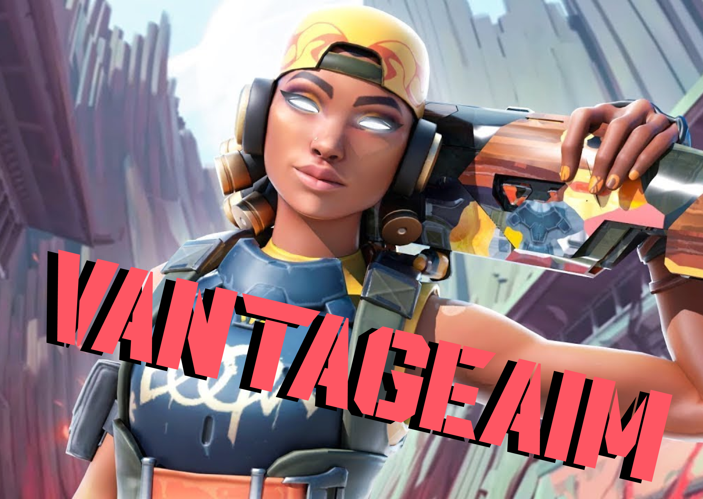

# ✨VantageAim✨ - Precision and Control in Valorant! 🎯

VantageAim is a customizable macro designed to enhance your aiming consistency and recoil control in Valorant. 🔥 It's built to provide subtle assistance, helping you stay on target and improve your in-game performance. 💎 USE RESPONSIBLY and AT YOUR OWN RISK.

  <!-- Add your logo here. Remove this line if you don't want a logo. -->

## ✨ Features

🌟 Key Features to Enhance Your Valorant Experience: 🌟

*   🎯 Recoil Control Assistance: Fine-tuned macros to help you manage weapon recoil and maintain accurate fire. 🔫
*   ⚙️ Customizable Profiles: Create and save unique macro profiles for different weapons and agents. 🛡️
*   🖱️ Easy Toggle:  Quickly enable/disable the macro with a customizable hotkey. ⌨️
*   📊 Performance Monitoring:  Monitor your in-game accuracy and see the impact of VantageAim. 📈
*   🛡️ Low Profile Design:  Designed to minimize resource usage and avoid detection (see important disclaimer below!). 🕵️
*   🚀 Simple Setup: Easy-to-use configuration interface allows you to customize settings and get started quickly. 💨
*   📜 Open Source (with limitations): Parts of the code are open source for transparency and community contributions (see details below!). 👀
*   🔄 Continuous Improvement: Dedicated team constantly working on improving accuracy and compatibility. 🚀

## ⬇️ Installation

⚙️ Get Started with VantageAim in a Few Simple Steps: ⚙️

1.  Download the latest release from "releases/VantageAim.zip" ⬇️
2.  Extract the archive to your desired location. 📁
3.  Run the VantageAim.exe application. 💻
4.  Configure your settings in the user interface. 🖱️

## ⚙️ Configuration

🔧 Configuration Parameters (within the application UI): 🔧

*   Weapon Profile: Select the weapon you want to configure the macro for (e.g., Vandal, Phantom).
*   Sensitivity: Adjust the macro sensitivity to match your in-game settings.
*   Hotkey: Choose a key to toggle the macro on/off.
*   Recoil Pattern: Select from different recoil pattern options (if available).

---

⚠️ EXTREMELY IMPORTANT DISCLAIMER: ⚠️

*   USE AT YOUR OWN RISK: The use of any third-party software in Valorant is potentially against Riot Games' Terms of Service. *Using VantageAim could result in a ban from the game.* We are not responsible for any bans or other penalties you may incur.
*   INTENDED FOR PRACTICE AND SKILL DEVELOPMENT: This macro is intended to be used as a training tool to learn recoil patterns and improve aim control.
*   NO GUARANTEE OF DETECTION AVOIDANCE: We cannot guarantee that VantageAim will be undetectable. Riot Games constantly updates its anti-cheat measures.
*   ETHICAL USE IS MANDATORY: Do not use this macro in competitive environments or in a way that gives you an unfair advantage over other players.
*   LIMITED OPEN SOURCE: Only portions of the code related to UI and configuration are open source. The core macro functionality is not publicly available to prevent reverse engineering and potential misuse.

---

*Inspired by the desire to improve gaming skills and provide a tool for learning. Use responsibly and ethically!*
